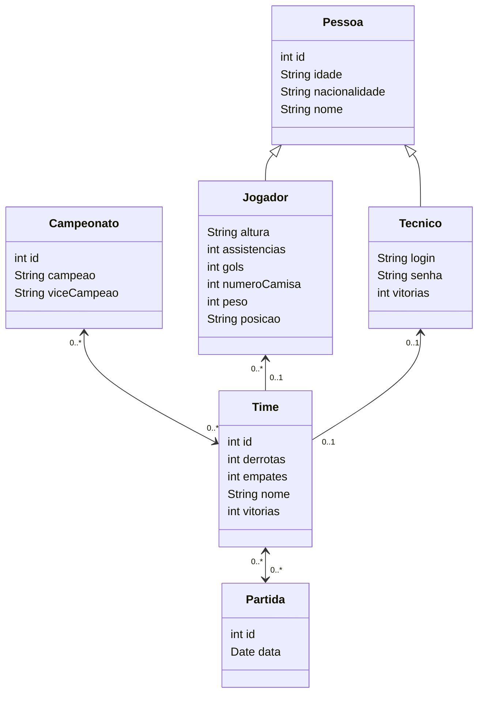

```mermaid
classDiagram
direction BT
class Campeonato {
    int  id
    String  campeao
    String  viceCampeao
}
class Jogador {
    String  altura
    int  assistencias
    int  gols
    int  numeroCamisa
    int  peso
    String  posicao
}
class Partida {
    int  id
    Date  data
}
class Pessoa {
    int  id
    String  idade
    String  nacionalidade
    String  nome
}
class Tecnico {
    String  login
    String  senha
    int  vitorias
}
class Time {
    int  id
    int  derrotas
    int  empates
    String  nome
    int  vitorias
}

Jogador  --|>  Pessoa 
Partida "0..*" <--> "0..*" Time 
Tecnico  --|>  Pessoa 
Time "0..*" <--> "0..*" Campeonato 
Time "0..1" --> "0..*" Jogador 
Time "0..1" --> "0..1" Tecnico 


```